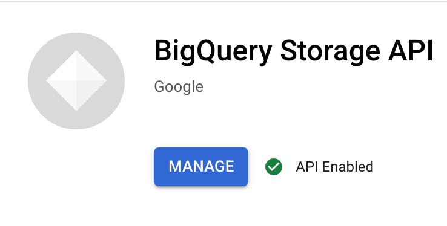
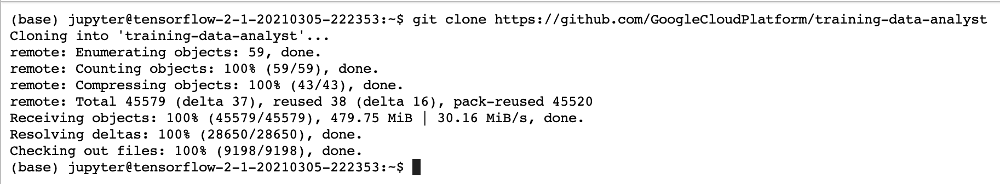
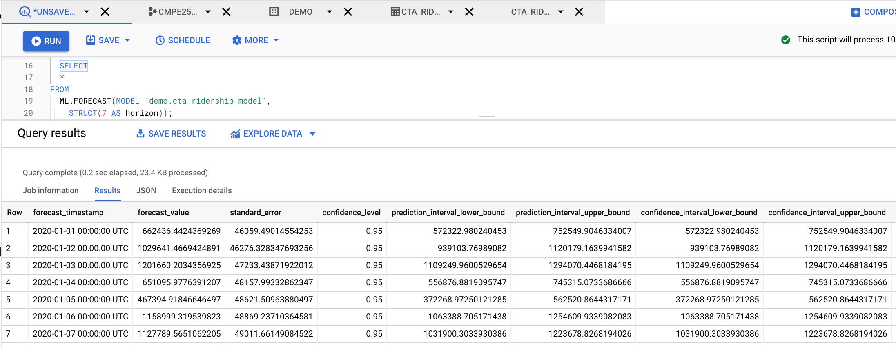

# Time Series Forecasting with the Cloud AI Platform and BQML  
Following the instructions in https://codelabs.developers.google.com/codelabs/time-series-forecasting-with-cloud-ai-platform#0

### Set Up
1.  Started with enabling the BigQuery Storage API 

2.  Downloaded the required lab materials

3.  Created an AI Platform Notebooks instance on the Cloud Console
4.  Navigated to training-data-analyst/courses/ai-for-time-series/notebooks executed 01-explore.ipynb, also checked in this file on github for reference.
The dataset for this notebook is cta_ridership.csv, also uploaded in github for reference.
We also uploaded this dataset on BigQuery:

5.  Navigated to training-data-analyst/courses/ai-for-time-series/notebooks executed 02-model.ipynb, also checked in this file on github for reference.
6.  Then, also completed the exercise on City of New York 311 Service Requests dataset by duplicating 01-explore.ipynb and 02-model.ipynb notebooks and modifying it accordingly.

**NOTE:**
More details are provided in the actual notebook and also in the screen recording video submitted along with this.

