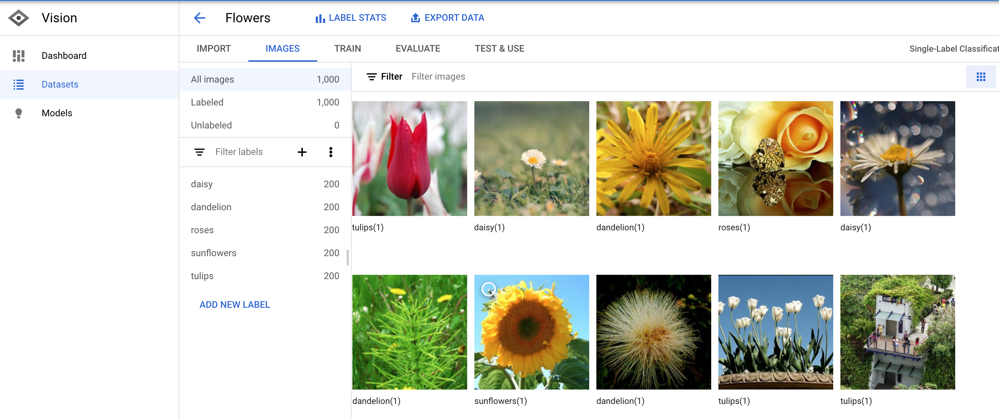
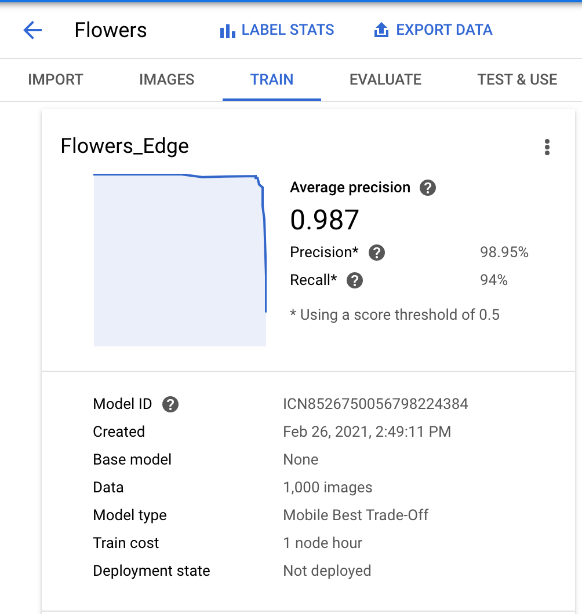
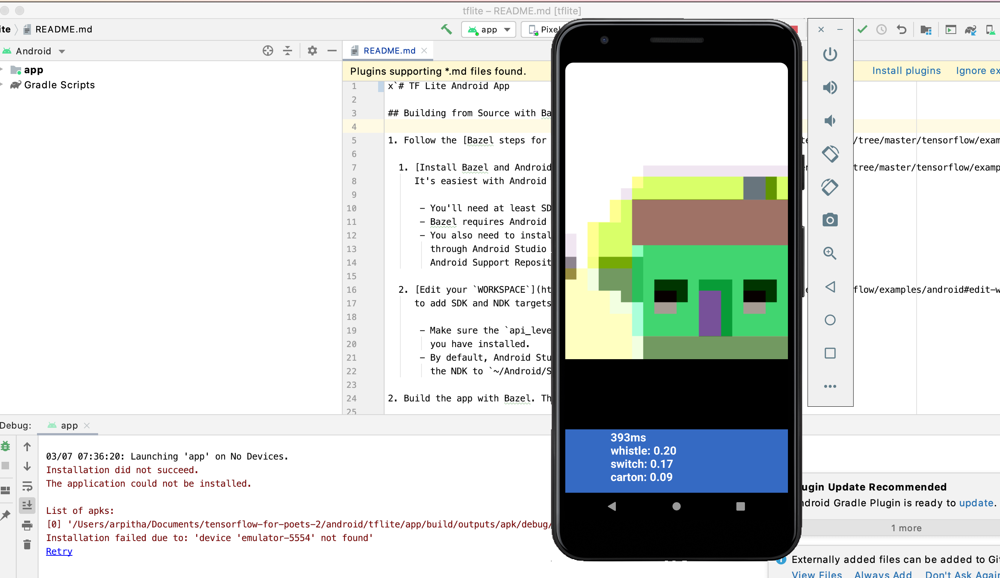

# Train and deploy on-device image classification model with AutoML Vision in ML Kit
Followed instructions as per: https://codelabs.developers.google.com/codelabs/automl-vision-edge-in-mlkit#1

Steps followed:
1. On Firebase Console created a new project called "ML Kit Codelab".

2. Added our Android app to the Firebase project and downloaded the google-services.json
3. Uploaded the training dataset of flowers - flower_photos.zip

5. Trained an image classification model for the above mentioned dataset.

7. We were also able to run our model on the firebase console itself.
8. Once the model was trained and deployed, we downloaded the model as .tflite and imported it into our android studio project.

